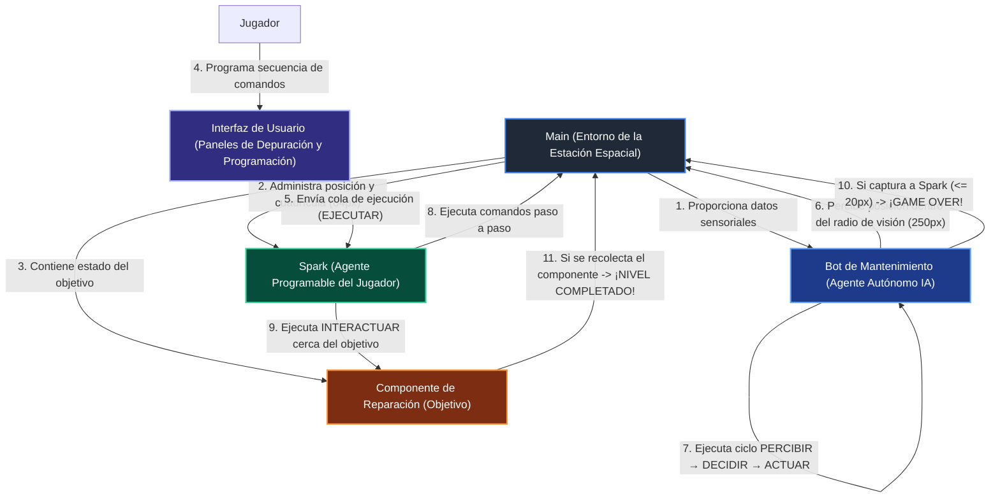
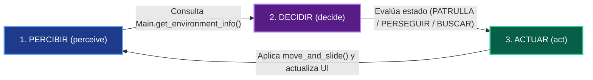
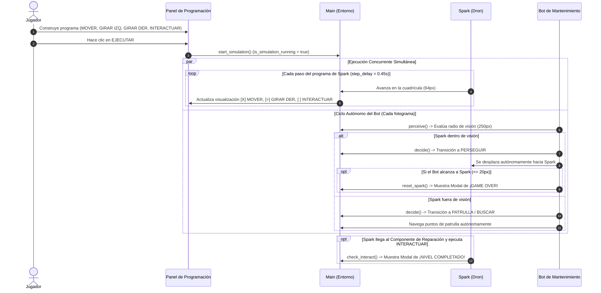

# Diagramas de Arquitectura General - Logic Loop

## 1. Arquitectura General del Sistema

```mermaid
graph TD
    classDef mainNode fill:#1f2937,stroke:#3b82f6,stroke-width:2px,color:#fff;
    classDef agentNode fill:#1e3a8a,stroke:#60a5fa,stroke-width:2px,color:#fff;
    classDef playerNode fill:#064e3b,stroke:#34d399,stroke-width:2px,color:#fff;
    classDef objNode fill:#7c2d12,stroke:#fb923c,stroke-width:2px,color:#fff;
    classDef uiNode fill:#312e81,stroke:#a5b4fc,stroke-width:2px,color:#fff;

    Main["Main (Entorno de la Estación Espacial)"]:::mainNode
    Bot["Bot de Mantenimiento (Agente Autónomo IA)"]:::agentNode
    Spark["Spark (Agente Programable del Jugador)"]:::playerNode
    Target["Componente de Reparación (Objetivo)"]:::objNode
    UI["Interfaz de Usuario (Paneles de Depuración y Programación)"]:::uiNode

    Main -->|"1. Proporciona datos sensoriales"| Bot
    Main -->|"2. Administra posición y cuadrícula (64px)"| Spark
    Main -->|"3. Contiene estado del objetivo"| Target
    
    Player["Jugador"] -->|"4. Programa secuencia de comandos"| UI
    UI -->|"5. Envía cola de ejecución (EJECUTAR)"| Spark
    
    Bot -->|"6. Percibe posición dentro del radio de visión (250px)"| Main
    Bot -->|"7. Ejecuta ciclo PERCIBIR → DECIDIR → ACTUAR"| Bot
    
    Spark -->|"8. Ejecuta comandos paso a paso"| Main
    Spark -->|"9. Ejecuta INTERACTUAR cerca del objetivo"| Target
    
    Bot -->|"10. Si captura a Spark (<= 20px) -> ¡GAME OVER!"| Main
    Target -->|"11. Si se recolecta el componente -> ¡NIVEL COMPLETADO!"| Main
```

## 2. Ciclo PERCIBIR → DECIDIR → ACTUAR

```mermaid
graph LR
    classDef perceive fill:#1e3a8a,stroke:#60a5fa,stroke-width:2px,color:#fff;
    classDef decide fill:#581c87,stroke:#c084fc,stroke-width:2px,color:#fff;
    classDef act fill:#065f46,stroke:#34d399,stroke-width:2px,color:#fff;

    sub_perceive["1. PERCIBIR (perceive)"]:::perceive
    sub_decide["2. DECIDIR (decide)"]:::decide
    sub_act["3. ACTUAR (act)"]:::act

    sub_perceive -->|"Consulta Main.get_environment_info()"| sub_decide
    sub_decide -->|"Evalúa estado (PATRULLA / PERSEGUIR / BUSCAR)"| sub_act
    sub_act -->|"Aplica move_and_slide() y actualiza UI"| sub_perceive
```

## 3. Diagrama de Secuencia de Ejecución

```mermaid
sequenceDiagram
    autonumber
    actor Jugador
    participant UI as Panel de Programación
    participant Main as Main (Entorno)
    participant Spark as Spark (Dron)
    participant Bot as Bot de Mantenimiento

    Jugador->>UI: Construye programa (MOVER, GIRAR IZQ, GIRAR DER, INTERACTUAR)
    Jugador->>UI: Hace clic en EJECUTAR
    UI->>Main: start_simulation() (is_simulation_running = true)
    
    par Ejecución Concurrente Simultánea
        loop Cada paso del programa de Spark (step_delay = 0.45s)
            Spark->>Main: Avanza en la cuadrícula (64px)
            Main->>UI: Actualiza visualización [X] MOVER, [>] GIRAR DER, [ ] INTERACTUAR
        end
    and Ciclo Autónomo del Bot (Cada fotograma)
        Bot->>Main: perceive() -> Evalúa radio de visión (250px)
        alt Spark dentro de visión
            Bot->>Main: decide() -> Transición a PERSEGUIR
            Bot->>Spark: Se desplaza autónomamente hacia Spark
            opt Si el Bot alcanza a Spark (<= 20px)
                Bot->>Main: reset_spark() -> Muestra Modal de ¡GAME OVER!
            end
        else Spark fuera de visión
            Bot->>Main: decide() -> Transición a PATRULLA / BUSCAR
            Bot->>Main: Navega puntos de patrulla autónomamente
        end
    end

    opt Spark llega al Componente de Reparación y ejecuta INTERACTUAR
        Spark->>Main: check_interact() -> Muestra Modal de ¡NIVEL COMPLETADO!
    end
```
