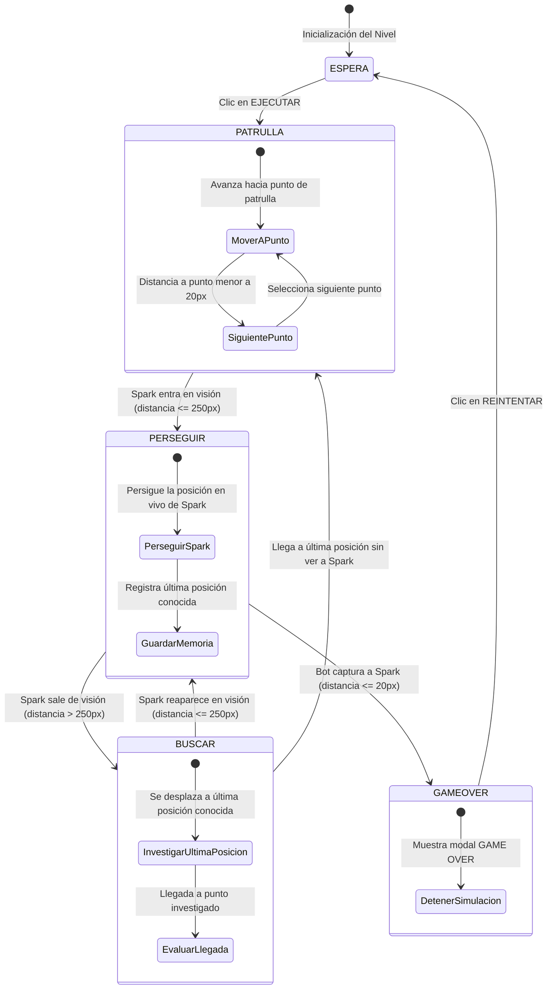

# Diagrama de la Máquina de Estados Finita (FSM) - Bot de Mantenimiento

## Resumen de Estados

1. **`ESPERA`**: Simulación pausada. Espera a que el jugador arme su secuencia y haga clic en **`EJECUTAR`**.
2. **`PATRULLA`**: El robot navega autónomamente entre los puntos de control de la estación espacial ($100\text{px/s}$).
3. **`PERSEGUIR`**: Spark entra en la zona de visión ($250\text{px}$). El robot persigue su posición en vivo ($180\text{px/s}$).
4. **`BUSCAR`**: Spark sale del área de visión. El robot se desplaza a la última posición conocida. Al llegar ($\le 20\text{px}$) sin ver a Spark, retorna a **`PATRULLA`**.
5. **`GAMEOVER`**: El robot alcanza a Spark ($\le 20\text{px}$). La simulación se detiene y se muestra la ventana emergente de Game Over.
